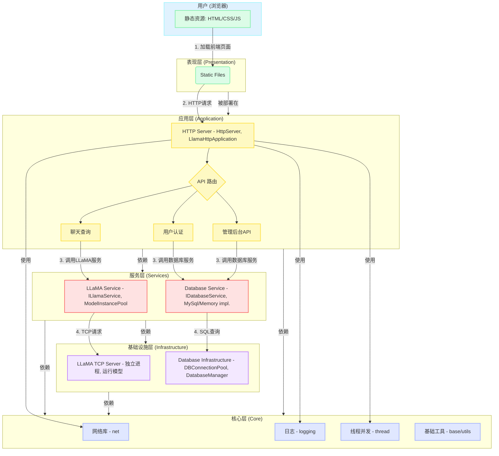

## 项目的起源：一个学习的起点

最初，这只是我学习《Linux高性能服务器编程》时的一个练手项目——一个基础的 Web 服务器。然而，随着对大语言模型（LLM）的兴趣日益浓厚，我萌生了一个想法：能否将这本书中的高性能网络编程技术，与AI模型的服务化落地相结合？

这个想法，便是我构建 Llama-WebServer 的开端。我的目标很明确：将一个简单的同步阻塞服务器，一步步改造为能够承载 LLaMA 这类大模型、并从容应对高并发请求的AI推理服务后端。

## **1. 项目概述**

`LlamaSever` 是一个基于C++构建的高性能、可扩展的Web服务平台，旨在为大型语言模型（LLM）如LLaMA提供一个稳定、高效且功能丰富的交互界面。项目采用现代化的软件工程实践，实现了一个从底层网络通信到前端用户界面的全栈解决方案。

其核心设计哲学是**“高内聚、低耦合”**，通过精心的模块化分层，将复杂的系统拆解为一组职责清晰、易于维护和独立测试的组件。这使得项目不仅能轻松应对高并发的生产环境需求，也为未来的功能扩展和技术迭代奠定了坚实的基础。

## **2. 模块化架构**

`LlamaServer` 的架构设计分为五个层次分明的核心模块，每一层都建立在前一层提供的能力之上，共同构成一个健壮而灵活的系统。

**架构层级说明:**

- **核心层 (`Core`)**: 项目的基石，提供与业务完全解耦的底层能力。
  - **网络库 (`net`)**: 实现了一个基于Reactor模式（`one loop per thread`）的高性能TCP网络库，包含事件循环、TCP服务器/连接、Channel、Poller等核心组件，是整个HTTP服务的动力引擎。
  - **日志系统 (`logging`)**: 提供了高性能的异步日志功能，支持日志级别、滚动文件和多线程安全写入，保证了在高并发下对系统状态的可观测性。
  - **线程与并发 (`thread`)**: 封装了线程管理、异步任务队列 (`AsyncTaskQueue`) 和线程池，为耗时操作（如模型推理）提供了异步处理机制，避免阻塞网络I/O线程。
  - **通用工具 (`utils`)**: 包含配置管理器 (`ConfigManager`)、内存池 (`memoryPool`)、一致性哈希 (`ConsistenHash`) 等高度可复用的高级组件。
- **基础设施层 (`Infrastructure`)**: 为上层服务提供具体的后端支撑。
  - **LLaMA TCP服务器 (`llama_tcp_server`)**: 这是一个独立的可执行进程，负责直接加载和运行LLaMA模型。它通过TCP端口对外暴露推理能力，实现了模型服务与Web服务的物理隔离，增强了系统的稳定性和可扩展性。
  - **数据库基础设施 (`database_infra`)**: 包含了高性能的数据库连接池 (`DBConnectionPool`) 和封装了底层SQL操作的 `DatabaseManager`，为上层提供了稳定、高效的数据访问能力。
- **服务层 (`Services`)**: 业务逻辑与底层实现的“隔离带”，定义了统一的服务接口。
  - **LLaMA服务 (`llama_service`)**: 通过 `ILlamaService` 接口 定义了模型查询的统一规范。`LlamaTcpService` 作为其实现，负责与后端的 `llama_tcp_server` 进行TCP通信。`ModelInstancePool` 则进一步提供了连接池化、负载均衡和故障恢复能力。
  - **数据库服务 (`database_service`)**: `IDatabaseService` 接口 抽象了所有数据操作（如用户管理、缓存读写）。`MySqlDatabaseService` 提供了具体的MySQL实现，而 `MemoryDatabaseService` 则为测试和开发提供了便利。这种设计使得切换数据库后端变得轻而易举。
- **应用层 (`Application`)**: 项目的业务逻辑中枢。
  - **HTTP服务器 (`http_server`)**: 在核心网络库之上，构建了完整的HTTP协议支持，包括请求/响应处理、路由、中间件 (`Middleware`) 等。
  - **主应用逻辑 (`main_app`)**: `LlamaHttpApplication` 是整个Web应用的核心控制器。它在启动时负责**装配**所有模块：加载配置、初始化服务、注册中间件链和定义所有API路由，最终处理用户的每一个HTTP请求。
- **表现层 (`Presentation`)**: 用户直接交互的前端界面。
  - **静态资源 (`static_files`)**: 存放于 `static/` 目录下的HTML、CSS 和JavaScript 文件。前端通过 `fetch` API 与应用层暴露的HTTP接口进行通信，实现了前后端分离，为用户提供了现代化、响应迅速的聊天和管理界面。

## **3 思考与改进**
