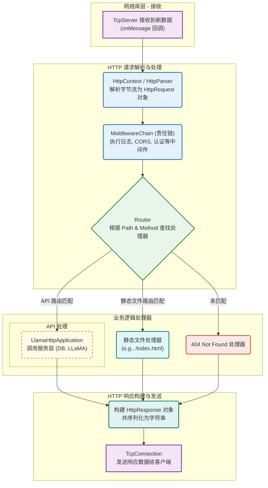
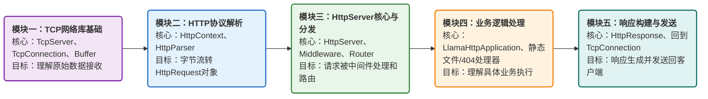

## HTTP Server 模块是什么？

在开发 AI 问答助手这类应用时，HTTP Server 模块是连接用户（业务层）与核心 AI 能力（服务层）的 “桥梁”。它封装了底层网络通信逻辑，通过标准化的 HTTP 接口接收用户提问，调用 AI 模型生成答案后再返回结果。

为什么需要它？因为直接让 AI 模型裸跑无法支撑多端访问（网页、APP、小程序都需要调用），更扛不住用户量增长后的并发请求。

下面的流程图展示一个 HTTP 请求从被底层 TcpServer 接收，到最终响应被发送回客户端的完整生命周期。

**流程图解读：**

1. **接收数据**：一个 TCP 连接上有数据到达时，会触发 `onMessage` 回调，将原始的字节流数据交给 HTTP 模块处理。
2. **请求解析与处理**：
   - **解析**：`HttpContext` 和 `HttpParser` 协同工作，像一个翻译官，将无格式的字节流翻译成程序可以理解的、结构化的 `HttpRequest` 对象（包含请求头、路径、方法、正文等）。
   - **中间件**：在进入核心业务逻辑之前，请求会穿过一个由 `Middleware` 组成的“安检通道”（责任链模式）。在这里，可以执行日志记录、用户认证、CORS 跨域检查等一系列通用操作。
3. **路由分发**：请求经过“安检”后，到达 `Router`（路由器）。`Router` 会检查请求的 URL 路径和方法（如 `GET /api/query`），然后像一个交通警察一样，将请求指向正确的处理器。
4. **业务逻辑处理 **：
   - **API 处理**：如果请求匹配了一个 API 路由，它会被分发给 `LlamaHttpApplication`。这是业务逻辑的核心，它会去调用更下层的服务（如数据库服务、LLaMA 服务）来完成具体的任务。
   - **静态文件处理**：如果请求的是一个静态文件（如 `index.html` 或 `style.css`），`静态文件处理器` 会直接从磁盘读取文件内容。
   - **404 处理**：如果 `Router` 找不到任何匹配的处理器，就会交给 `404 处理器` 来生成一个“未找到”的错误页面。
5. **响应构建与发送**：
   - **构建**：无论哪个处理器完成了任务，它们都会生成一个 `HttpResponse` 对象。这个对象会被序列化成符合 HTTP 规范的字符串（包含状态行、响应头和响应体）。
   - **发送**：最后，这个响应字符串通过 `TcpConnection` 发送回用户的浏览器，完成整个请求-响应周期。

## 怎么理解HTTP Server 模块？

理解 `HttpServer` 模块的关键在于**自底向上**地看，先理解它的地基（网络库），再看它如何在地基上搭建起 HTTP 协议的高楼。

下面是参考的理解步骤：

需要思考几个问题：

1、理解当一个客户端（如浏览器）连接到服务器并发送数据时，数据是如何通过 `TcpServer` 被接收，并最终以原始字节流的形式出现在 `TcpConnection` 的 `onMessage` 回调中的。

2、明白 `HttpServer` 是如何在其 `onMessage` 回调中，利用 `HttpContext` 将 `TcpConnection` 送来的原始字节流，转换成一个完整的 `HttpRequest` 对象的。

3、掌握 `HttpServer` 在成功解析一个请求后，是如何通过中间件链和路由表，最终找到应该处理这个请求的具体业务逻辑函数的。

4、理解一个具体的 API 请求（如 AI 问答）是如何在 `LlamaHttpApplication` 中被处理，并最终生成一个 `HttpResponse` 返回给 `HttpServer`，再由 `HttpServer` 通过底层的 `TcpConnection` 发送回客户端的。